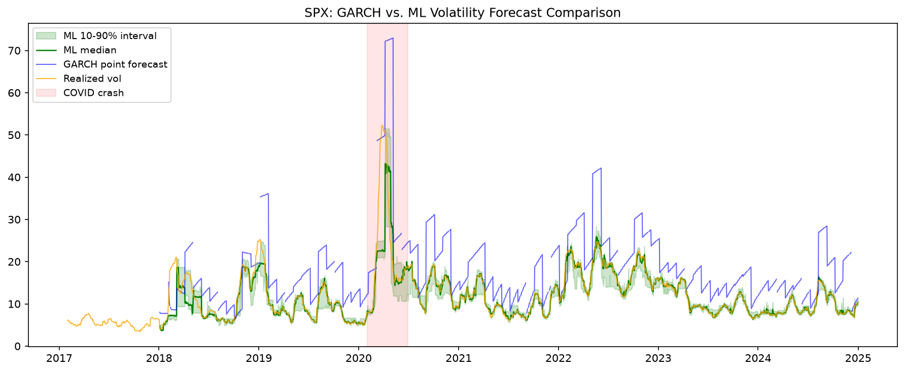

# GARCH vs. ML Volatility Forecasting

I built this to understand *why* volatility is hard to forecast, not just to see if a fancier model could beat a simpler one. The short version: a gradient-boosted tree does beat GARCH(1,1) here, but not for the reason you might expect, and it comes with its own real weakness that only shows up when you actually check for it.

## What I found

Across four very different assets (a calm blue-chip stock, a volatile tech stock, the S&P 500, and Bitcoin), a LightGBM model trained with walk-forward validation beat GARCH(1,1) on every standard accuracy metric, RMSE and QLIKE, a loss function from the volatility forecasting literature that specifically punishes underestimating risk. The gap gets bigger the more chaotic the asset is; on Bitcoin, ML's error is roughly a fifth of GARCH's.

But accuracy isn't the whole story. When I checked whether each model's uncertainty estimates could actually be trusted, does an "80% confidence interval" really contain the true outcome 80% of the time, GARCH fell apart. Its intervals were only right 43-57% of the time, badly overstating its own confidence. The ML model's intervals landed almost exactly where they should, every time.

The one place this flips: during the Feb 2020 COVID crash, on the calmest asset in the set, ML's forecasts got worse than GARCH's. My best explanation is that ML leans heavily on very recent volatility as a feature, which works great in normal conditions but backfires the moment volatility itself is changing faster than the model can react to. GARCH's simpler, built-in tendency to revert toward an average actually helped it there. I think this is the most interesting result in the whole project, a genuine limitation, not something to explain away.

## The assets

I picked four assets specifically because they behave differently, not similarly, since the whole point was to see how each model handled very different "personalities" of volatility.

| Asset | Ticker | Why it's here |
|---|---|---|
| S&P 500 | ^GSPC | The default, broad-market case |
| Coca-Cola | KO | Boring on purpose, a low-volatility control |
| NVIDIA | NVDA | High-beta, swings hard |
| Bitcoin | BTC-USD | The extreme case, trades every day of the week |

## How it works

**Data**: 8 years of daily prices (2017-2024), pulled with yfinance. Getting this right took more care than I expected, since split-adjustments, and reconciling the fact that Bitcoin trades on weekends while stocks don't, are both easy to get subtly wrong.

**Target**: I didn't just use close-to-close volatility, since that throws away information already sitting in the data. Instead I used the Garman-Klass estimator for the stocks (it uses the full OHLC range) and Parkinson for Bitcoin (it doesn't assume the "overnight gap" that doesn't really apply to a market that never closes).

**GARCH baseline**: a GARCH(1,1) with a Student-t distribution, refit every 21 days on an expanding window. Refitting periodically instead of once was deliberate, since it's a form of walk-forward validation, and it's the same discipline the ML model needed.

**ML model**: LightGBM, trained to predict three quantiles (10th, 50th, 90th) instead of a single number, so it produces an actual predictive range rather than a point guess. Features are lagged realized volatility, lagged squared returns, rolling volume, and the sign of recent returns (a rough proxy for the leverage effect). Critically, it's evaluated on the *exact same* dates as GARCH. I built a shared walk-forward split function specifically so the comparison couldn't be accidentally unfair.

**Evaluation**: RMSE, QLIKE, and calibration, including a dedicated check on just the COVID crash window, since a model can look well-calibrated on average while badly failing exactly when it matters most.

## Project structure

    notebooks/
      01_data_check.ipynb          - download, clean, and align the data
      02_realized_volatility.ipynb - build the volatility target
      03_garch_baseline.ipynb      - GARCH(1,1) walk-forward baseline
      04_walkforward_cv.ipynb      - shared CV logic used by both models
      05_ml_model.ipynb            - LightGBM quantile model
      06_evaluation.ipynb          - QLIKE, calibration, and the crash-period breakdown
    src/
      download_data.py             - data download script
    data/                          - not tracked in git; regenerate with src/download_data.py

## Running it yourself

    git clone <your-repo-url>
    cd Volatility-forecasting-with-GARCH-vs.-ML-models
    python -m venv venv
    source venv/bin/activate  # Windows: venv\Scripts\Activate.ps1
    pip install -r requirements.txt
    python src/download_data.py

Then work through the notebooks in order, 01 to 06.

## License

MIT

